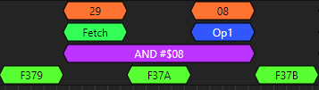

# Logic Analyzer for 6502 / Junior Computer 2
First of all, I got inspired by some awesome people:
- gusmanb (Agustín Gimenez Bernad), he created something very special: a Pico based Logic-Analyzer. Check it out at  https://github.com/gusmanb/logicanalyzer
- A guy called Happy Little Diodes, who made a wireless Logic Analyzer for his ZX spectrum, check his video at https://www.youtube.com/watch?v=IHbIW8pi4Vo

# Introduction
For the Junior computer I needed a decent Logic Analyzer. The Logic Analyzer that I have, is only 8 channels. Not much when you want to analyze the address-bus (16 bit) and the databus (8 bit) together with some control-signals. So I needed something like 30 channels. Gusmanb designed a Pico based Logic-Analyzer that was 24-bit, but could be cascaded up to 5 x 24 bits, amazing!

The video from Happy Little Diodes showed how to cascade two boards together for wireless (!) debugging of a ZX-Spectrum. Now that is what I wanted, but then for the 6502 processor. I ordered the PCBs that Gusmanb made and hand-soldered them with a hot-air station, a microscope and a SMD-oven. I also installed the firmware on the Pico-W boards and installed the software on the PC. It all worked like a charm! This is really amazing, since back in the days you needed an entire cabinet full of equipment in order to do the same. And now it is even wireless!

The Logic-Analyzer software incorporates the protocol decoders from the Sigrok project. These protocol-decoders analyze the logic signals and show uself information derived from that. For the 6502 processor, this would be the address- and data-bus in hex, the current cycle of the processor (Fetch, read OP1, read OP2, Read, Write) but above all, a nice disassembly of that instruction, exactly what Happy Little Diodes showed for the Z80. So if the 6502 processor is doing a fetch and it reads $20 (hex) (which is a Jump to Subroutine (JSR) instruction), it should read the next two bytes and use that as the address to jump to. Wouldn't it be nice if the Logical Analyzer would show JSR $E40F (or whatever address it is reading) for these bytes? 

Although the Sigrok project contains lots of protocol-decoders, unfortunately there's no working 6502 protocol-decoder available. So I decided to write it myself. Well, not entirely, someone named David Banks made a first attempt at a 6502 protocol decoder, but it was only half finished and didn't really work. Nevertheless, I used this as the basis for my 6502 protocol-decoder. These protocol-decoders are written in Python, which is a terrible language by the way, and such a Python protocol decoder can completely stop working if you only have one space in the wrong place. Or if you have a wrong variable name it also stops working without any warning whatsoever. You just have to undo your typing until it starts to work again. And you have to indent carefully, because that is the way Python handles block-statements. But I managed to get this 6502 protocol decoder working after all, see the screen-shots below.

This project contains of two parts: the JC2 hardware interface and the Python protocol-decoder. All other stuff (PCBs with Pico, Logic Analyzer firmware and software) can be obtained from the sources above.

# Hardware interface for the JC2

I wanted to interface the two cascaded Logic-Analyzer prints to the JC2, so that I don't have to wire up 30 Dupont wires. I did that for testing anyway, but better of-course if you can just connect the two Logic-Analyzer boards (with the Pico's on it) to this PCB.

Another feature I wanted to add is triggering. Since the Logic-Analyzer only has limited triggering capabilities in multi-device mode, I wanted to add a trigger input that is activated when a particular address is placed on the address-bus. Would be nice if I also could select a Read or Write operation. Furthermore, triggering on a particular data-byte would also be useful.

TODO: describe Kicad PCB project here.

# Python protocol decoder

Installing the protocol decoder is easy. Just copy the MOS6502 directory in this repository with its contents into the decoders subdirectory of the Logic-Analyzer program from Gusmanb and start the program. I am not going into details of the design here, but I wanted to show a few screen-shots of various 6502 instruction modes in order to prove that the decoder is working. The 6502 has 13 different instruction modes, which I hope to show you here.

All screen-shots are taken from a working Logic-Analyzer with the 6502 protocol-decoder loaded. The system under test is a JC2 (Junior Computer 2) Single-Board-Computer running at 1 MHz.

### Bugs
There are still a couple of cases, where the protocol decoder is going wrong and displays a wrong opcode. It is not a systematic fault, because further down the bitstream the same instruction is displayed correctly. This is work-in-progress!

## 6502 details
A few things are important in order to understand the screen-shots of the Logic-Analyzer:
- The 6502 has several clock-signals of which PHI1 (input) and PHI2 (output) are the most relevant. PHI2 is (more or less) the inverted version of PHI1.
- A Fetch operation (reading the opcode of the instruction) is initiated with SYNC going high. At the same time, the clock-line PHI2 goes low. The datasheet says: "The SYNC line goes high during PHI1 of an opcode Fetch and stays high for the remainder of that cycle". The protocol-decoder shows that SYNC goes high pretty much at the same time as PHI1 goes high, which is the same as PHI2 going low.
- The address is put onto the address-bus when the clock-line PHI2 is low. The address set-up time Tads has a max. of 225 nsec (for a 1 MHz clock), so the logic-analyzer reads the address-bus just before a rising-edge of the PHI2 clock-line (which is after 500 nsec. for a 1 MHz clock).
- The data is put onto the data-bus when the clock-line PHI2 is high. The logic-analyzer reads the data-bus just before a falling-edge of the PHI2 clock-line.
- When SYNC is high AND the PHI2 clock-line is high, the 6502 processor is doing an opcode Fetch. This is the start of an instruction. Depending on the instruction type, it may read 0, 1 or 2 more bytes. Byte 1 is called Op1, byte 2 is called Op2.

 
*SYNC and PHI2 during a Fetch*

## Implied mode
Implied mode is easy, it is just a single instruction like Clear-Carry (CLC), Decrement-X (DEX) or Return-from-Subroutine (RTS). Even though it is a single instruction, it is always at least two clock-cycles, but may be up to 6 clock-cycles in duration.

 
*CLC Instruction*
The CLC opcode ($18) is at address $F375, after this fetch the processor does a dummy read and then proceeds to the next opcode fetch at $F376.

 
*RTS Instruction*
The RTS opcode ($60) is at address $F381, after this fetch the processor does the following:
- a dummy read from $F382
- a read from the first stack location at $01F7, don't know why it is doing this.
- two more reads from the stack (addresses $01F8 and $01F9). This gives the return-address - 1, which is $E1D6 in this case.
- another dummy read of this return address at $E1D6 with an increment of the program-counter, so that the address now becomes $E1D7, where a new opcode Fetch can be done

## Accumulator mode
 
*LSR A Instruction*

## Immediate mode
 
*AND Immediate Instruction*

## Absolute mode
 
*LDA Absolute Instruction*

 
*STA Absolute Instruction*

## X-indexed absolute mode
 
*ASL Absolute,X Instruction*

## Y-indexed absolute mode
 
*STA Absolute,Y Instruction*

## Absolute Indirect mode
 
*JMP Indirect Instruction*

## Zero Page mode
 
*STA Zero Page Instruction*

## X-Indexed Zero Page mode
 
*INC Zero Page,X Instruction*

## Y-Indexed Zero Page mode
 
*STX Zero Page,Y Instruction*

## X-Indexed Zero Page Indirect mode
 
*STA Indirect,X Instruction*

## Zero Page Indirect Y-indexed mode
 
*LDA Indirect-Y Instruction*

 
*STA Indirect-Y Instruction*

## Relative addressing mode
Relative addressing mode are the branch instructions. They typically contain a number (in OP1) between -128 and +127 relative to the next instruction address. There's a difference in number of instruction clock-cycles between a branch not taken and a branch taken.

 
*BEQ Branch-not-taken Instruction*

 
*BCC Branch-taken Instruction*

